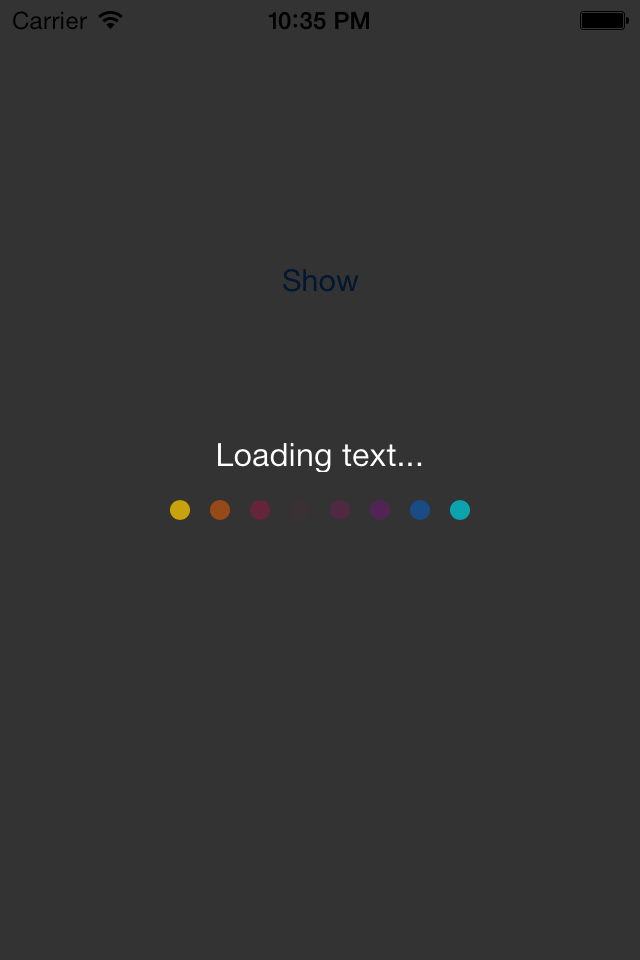
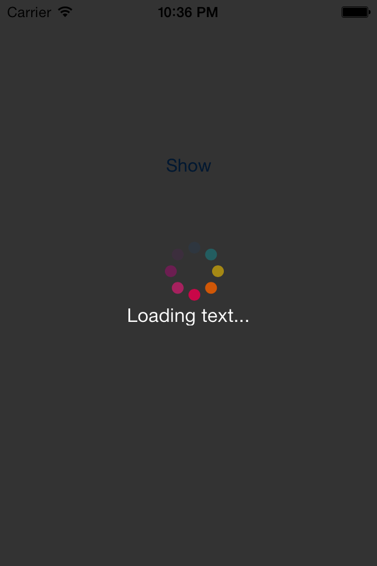
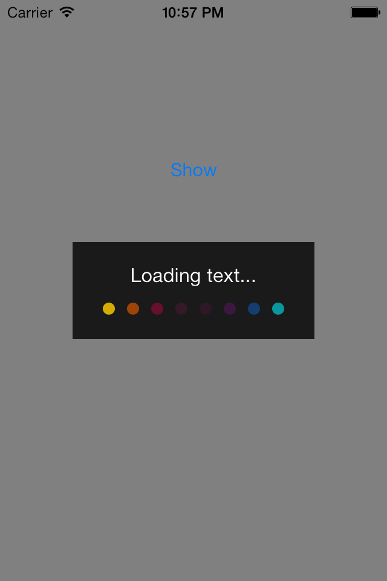
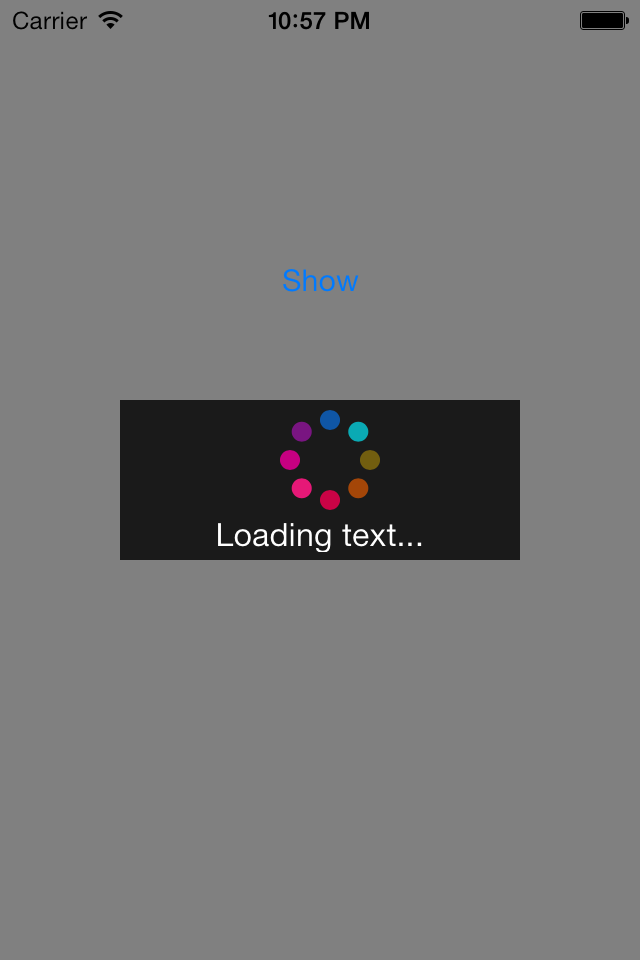

CLProgressHUD
=============

CLProgressHUD is a colorful progress loading view for your iPhone or iPad APP.It works on any iOS version and is compatible with ARC projects. 

###ScreenShots
<span></span>
<span></span>
<span></span>
<span></span>


###Usage
####Example
```  
CLProgressHUD *hud = [[CLProgressHUD alloc] initWithView:self.view];
[self.view addSubview:hud];
hud.text = @"Loading...";
hud.shape = CLProgressHUDShapeLinear;
hud.type = CLProgressHUDTypeDarkForground;
[hud showWithAnimation:NO duration:5];
```
####Method
```
- (void)showWithAnimation:(BOOL)animated;
- (void)showWithAnimation:(BOOL)animated duration:(NSTimeInterval)duration;
- (void)dismissWithAnimation:(BOOL)animated;
```
####You Can Set up
* text
* CLProgressHUDType
* CLProgressHUDShape
* diameter
